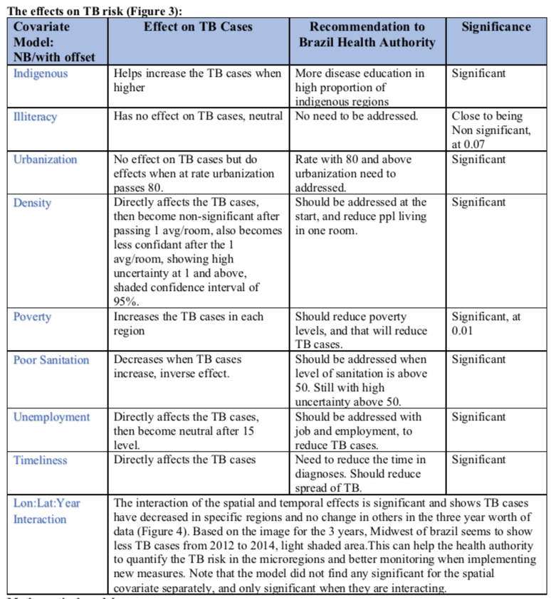

# Analysis-of-TB-Cases-in-Brazil in R
Analysis of Tuberculosis (TB) Cases in Brazil using Spatial and temporal data in R, and modeling of the TB cases was done using Generalized Additive models (GAM) for modeling linear and non linear covariates. 

<b>Table of Contents:</b>
<b>Libraries Used:</b>
<b>The Response:</b>
<b>Modeling Process:</b>

<b>Libraries Used:</b>
MASS
mgcv
lme4
ggplot2

<b>The Response:</b>

The response is TB cases which represent count data, staring at zero and ending with 9,097. The data to be modeled is skewed to the right with many outliers (Figure 6). Where most of the frequency of cases are centered around a mean of 125, median of 35 and variance of 27,797 (overdispersion). The covariates are mostly all continuous measuring Density, Illiteracy, Urbanization, Indigenous community, Poverty, Sanitation, Unemployment with the exception of Year as a factor, and a Spatial covariates of a longitude and latitude of 557 unique micro regions. Each micro region has a distinct population and a unique TB count. Understanding the effects on the TB cases with regard to the region and the year is the goal of this analysis. There are 3 years to model, and to see if they affect the TB count with regards to the micro regions. The Covariates:
The Covariates are mostly measurements of Socio-Economic indicators but with a coordinate and a time factor, interpreting and modeling the Spatial Temporal covariates where a challenge. The TB cases can be modeled either as a Poisson or a negative binomial (NB). In this analysis I have tried both and the NB shows a better fit benefiting from the NB flexibility in the variance. More in detail regarding the fit below. Analyzing linear and Non-Linear effects:
I started with plotting the Covariates against the TB cases (log) to see if any clear linear or nonlinear relationship can be seen. This can help in understating the effects on the TB cases and also helps in the modeling and the use of k’s method in the smoothing functions. GAM modeling assumes additivity between predictors but allows for local nonlinearity in each predictor. 

<b>Modeling Process:</b>
I have iterated through different models with the distribution for count data. The offset option makes the model fit better due to the large difference in the population covariate as a ceiling for the TB cases, if not addressed will assume that each micro region has the same size population. The Year covariate was treated as factor in the models, which showed significance in all models, additionally used the By method in the smoothing function to see if there is any spatial temporal interaction. The AIC and LRT tests where used to compare the models. Iterated through different basis functions and used the edf to measure best k number. Most required small k’s due to linear effects. All covariates have been used in the model, only covariate that could be removed is Illiteracy but kept because provided a high AIC when compared to the model without. QQ plot helped in identify that the model fitted the theoretical distribution, and a deviance test.

<b>Results</b>

Below is the table explaining the covariates and how they are interacting, and if they are linear and nonlinear.

